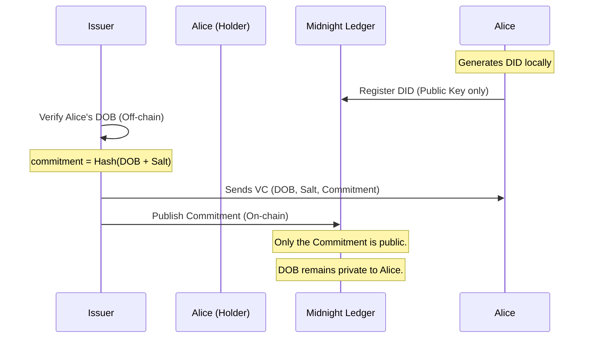
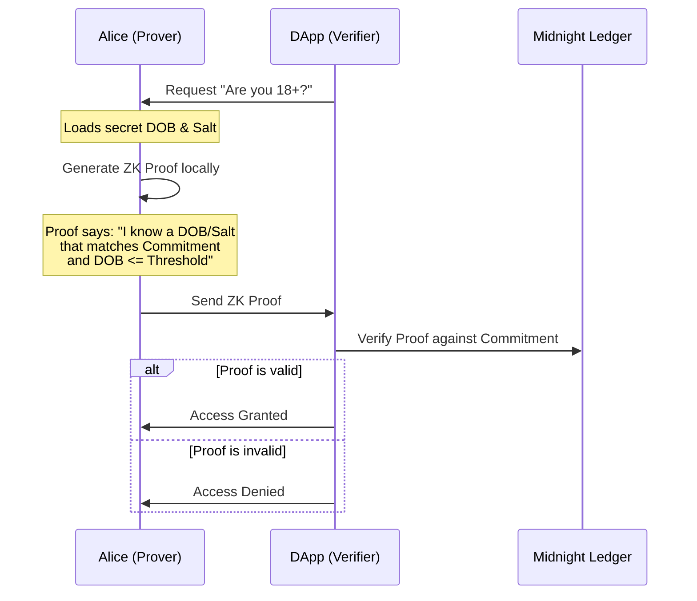

# Midnight DID Beginner Tutorial

Welcome to the Midnight DID Tutorial! This project demonstrates how to build a privacy-preserving Decentralized Identity (DID) system using the Midnight Network and Compact smart contracts.

👉 **[Start the Step-by-Step Tutorial here!](file:///home/pierre/my-did-tutorial/TUTORIAL.md)**

## Quality Standards
- **Error-Free**: All scripts and tests are verified to run out-of-the-box.
- **Beginner Friendly**: Clear explanations for ZK and DID concepts.
- **Privacy First**: No personal data ever touches the blockchain.

## Technical Architecture

### 1. Credential Issuance Flow
This flow shows how an Issuer (like a KYC provider) gives a credential to a Holder (Alice) without putting her data on the ledger.



### 2. Selective Disclosure Verification Flow
This flow shows how Alice proves she is over 18 without revealing her birth date.



## Privacy Guarantees

1. **Zero-Knowledge**: The Verifier only learns a "Yes/No" answer to a specific question (e.g., "Is she 18?"). They never see the underlying data.
2. **Unlinkability**: By using a unique `salt` for every credential, different DApps cannot correlate the same user unless the user explicitly chooses to link them.
3. **Self-Sovereignty**: Alice stores her private credentials and salts locally. She only generates proofs when she decides to share them.

## Getting Started

1. **Install Dependencies**:
   ```bash
   npm install
   ```

2. **Run the Demo**:
   ```bash
   npm run demo
   ```

3. **Run Unit Tests**:
   ```bash
   npm test
   ```

4. **Verify Offline (ZK Proof Generation)**:
   *Ensure you have a local proof server running.*
   ```bash
   npm run prove:age
   ```