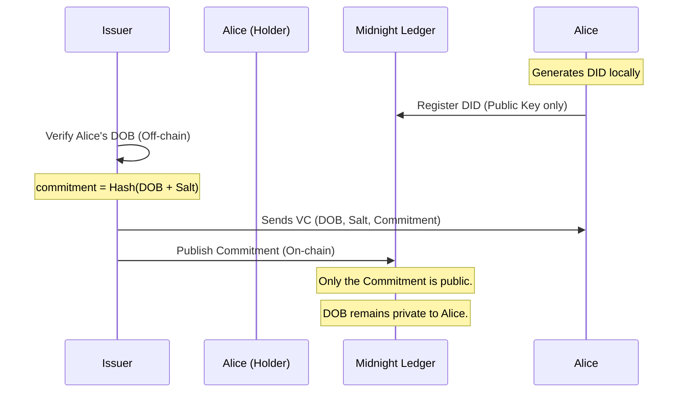
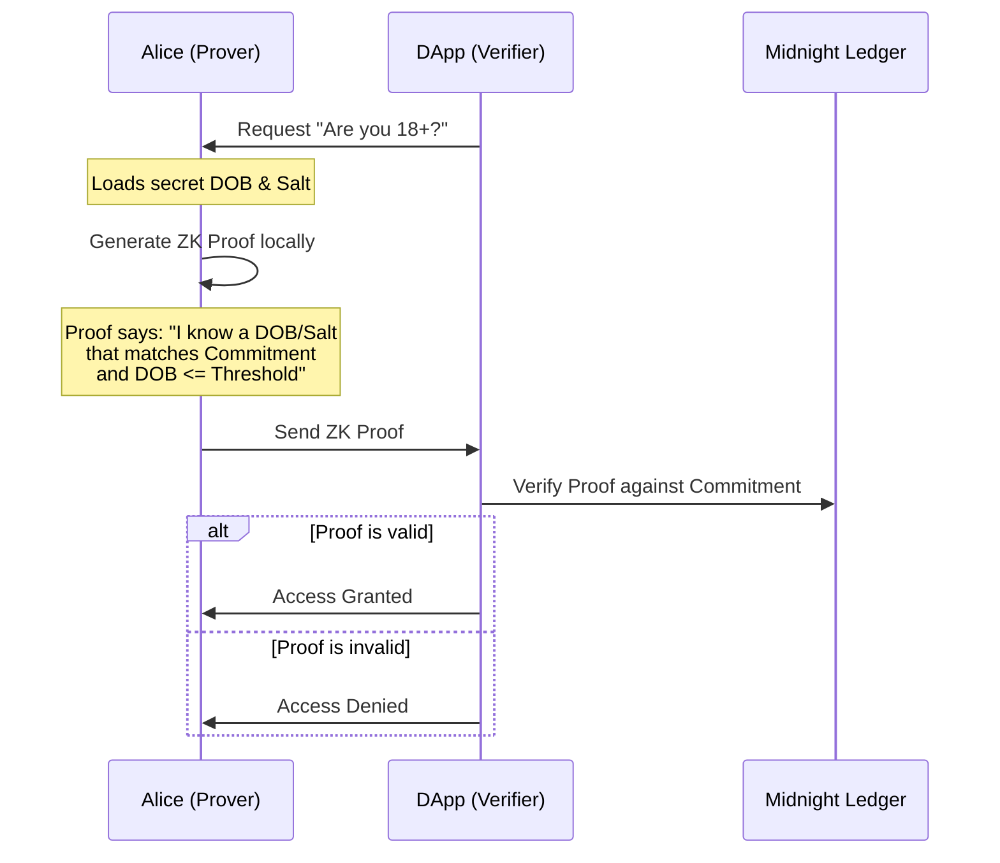

# Tutorial: Building a Decentralized Identity (DID) System on Midnight

Welcome to the Midnight DID tutorial. In this guide, you will learn how to build a production-ready, privacy-preserving identity system using **Midnight**, a data-protection blockchain.

By the end of this tutorial, you will have implemented three real-world Zero-Knowledge (ZK) scenarios:
1.  **Age Verification (18+)**: Prove age without revealing a birthdate.
2.  **Accredited Investor Status**: Prove wealth ($1M+) without revealing a bank balance.
3.  **Privacy-Preserving KYC/AML**: Prove nationality and ID validity without creating "data honeypots."

---

## 0. Glossary for ZK Newcomers

Before we dive in, let's define three core concepts you'll encounter:
- **Commitment**: A cryptographic "fingerprint" of your data (like a hash). You publish this on-chain. It doesn't reveal your data, but it "commits" you to it.
- **Witness**: The private data (like your birthday) that you provide *locally* to the ZK circuit. It never leaves your machine.
- **Proof**: The mathematical output of the ZK circuit. It proves that "I know a **Witness** that matches the on-chain **Commitment** and satisfies the rule (e.g., age > 18)."

---

## 1. Prerequisites

- **Midnight Compact Compiler**: v0.30.0+
- **Midnight SDK**: v4.0.2+
- **Docker**: For running the `midnight-proof-server`.
- **Node.js**: v22.0.0+

---

## 2. Architecting for Privacy

In a DID ecosystem, we use **Selective Disclosure** to reveal only the minimum necessary information.

### A. Credential Issuance Flow
This flow shows how an Issuer (like a KYC provider) gives a credential to a Holder (Alice) without putting her data on the ledger.



### B. Selective Disclosure Verification Flow
This flow shows how Alice proves she is over 18 without revealing her birth date.



> [!TIP]
> **Privacy Guarantee**: The core principle is that **PII (Personally Identifiable Information) never touches the blockchain.** Only a cryptographic commitment is registered.

---

## 3. Developing the Verifier Contract

We use **Compact**, Midnight's data-protection language, to define "circuits." These circuits verify conditions on private data without seeing the data itself.

### `verifier.compact`

```compact
pragma language_version >= 0.22 && <= 0.23;

import CompactStandardLibrary;

export { verifyAge, verifyAccredited, verifyKYC, computeAgeCommitment, computeInvestorCommitment, computeKYCCommitment }

// Use Case 1: Numerical Age Threshold
export pure circuit verifyAge(
    secret_dob: Uint<64>,
    secret_salt: Bytes<32>,
    threshold_dob: Uint<64>,
    expected_commitment: Bytes<32>
): [] {
    const d_threshold = disclose(threshold_dob);
    const d_expected = disclose(expected_commitment);
    const computed = computeAgeCommitment(secret_dob, secret_salt);

    assert(computed == d_expected, "Commitment mismatch");
    // Proof: Alice is older than X (older people have smaller YYYYMMDD values)
    assert(secret_dob <= d_threshold, "User is too young");
}

// ... Additional circuits for Investors and KYC ...
```

> [!IMPORTANT]
> **Privacy Guarantee**: The `secret_dob` and `secret_salt` are **private witnesses**. They are processed locally and are NEVER disclosed. Only the result of the `assert` contributes to the proof.

---

## 4. Off-Chain Credential Logic

The Issuer generates the credential. We use a **Salt** (random data) to ensure that even if two people have the same birthdate, their on-chain commitments look completely different. This prevents "correlation attacks."

### `src/credentials.ts`

```typescript
export function issueAgeCredential(
  issuer: DIDKeyPair,
  holderDid: string,
  dob: string,
  threshold: number
): Credential {
  const salt = randomBytes(32).toString('hex');
  const dobNum = parseInt(dob.replace(/-/g, '')); // YYYYMMDD
  
  // Padding to 32 bytes to match Compact's Bytes<32>
  const dobBuffer = Buffer.alloc(32);
  dobBuffer.writeUInt32BE(dobNum, 28);

  const commitment = createHash('sha256')
    .update(Buffer.concat([dobBuffer, Buffer.from(salt, 'hex')]))
    .digest('hex');

  return { claims: { dateOfBirth: dob }, commitment, salt };
}
```

---

## 5. Generating ZK Proofs

Alice generates a proof by connecting her application to a local **Proof Server**. This server performs the heavy mathematical lifting for the SNARK (Succinct Non-interactive ARgument of Knowledge).

### Interactive Verification (`scripts/prove-age.ts`)

```typescript
// 1. Setup Providers
const zkConfigProvider = new NodeZkConfigProvider(path.resolve('contracts/managed/verifier/compiler'));
const proofProvider = httpClientProofProvider('http://localhost:6300', zkConfigProvider);
const verifierInstance = new Contract({});

// 2. Generate Private Proof locally
await verifierInstance.circuits.verifyAge(
    context as any,
    secretDOBBigInt,   // Private witness (Witness)
    UserSalt,          // Private witness (Witness)
    thresholdDOB,      // Public input
    PublicCommitment   // Public input
);
```

> [!TIP]
> **Privacy Guarantee**: Even if the Verifier captures the ZK proof, they cannot "reverse" it to find your birthdate. The proof is a one-way mathematical guarantee.

---

## 6. Testing Guide

### Step 1: Start the Local Proof Server
```bash
docker run -p 6300:6300 midnightntwrk/proof-server:8.0.3 midnight-proof-server -v
```

### Step 2: Compile Contracts
```bash
npm run compile:verifier
```

### Step 3: Run Interactive Demos
Execute the scripts and follow the terminal prompts to see ZK privacy in action.

**Age (18+):**
```bash
npm run prove:age
```

**Investor ($1M+):**
```bash
npm run prove:investor
```

**KYC (Compliance):**
```bash
npm run prove:kyc
```

---

## Summary
You have successfully built a DID tutorial that leverages:
- **Numerical Inequalities** in ZK circuits for dynamic thresholding.
- **Selective Disclosure** to hide sensitive PII while proving compliance.
- **Salted Commitments** to prevent user tracking across different platforms.

Happy coding on Midnight!
