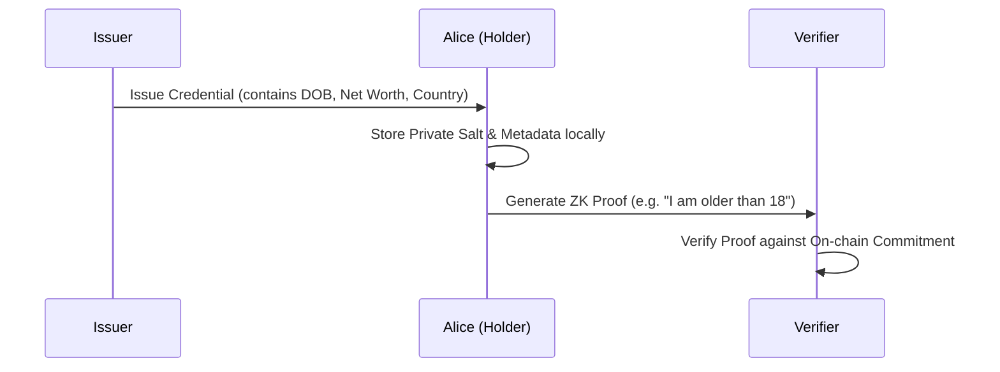

# Tutorial: Building a Decentralized Identity (DID) System on Midnight

Welcome to the Midnight DID tutorial. In this guide, you will learn how to build a production-ready, privacy-preserving identity system using **Midnight**, a data-protection blockchain.

By the end of this tutorial, you will have implemented three real-world Zero-Knowledge (ZK) scenarios:
1.  **Age Verification (18+)**: Prove age without revealing a birthdate.
2.  **Accredited Investor Status**: Prove wealth ($1M+) without revealing a bank balance.
3.  **Privacy-Preserving KYC/AML**: Prove nationality and ID validity without creating "data honeypots."

---

## 1. Prerequisites

- **Midnight Compact Compiler**: v0.30.0+
- **Midnight SDK**: v4.0.2+
- **Docker**: For running the `midnight-proof-server`.
- **Node.js**: v22.0.0+

---

## 2. Architecting for Privacy

In a DID ecosystem, we use **Selective Disclosure** to reveal only the minimum necessary information.



The core principle is that **PII (Personally Identifiable Information) never touches the blockchain.** Only a cryptographic **commitment** (a hash) is registered.

---

## 3. Developing the Verifier Contract

We use **Compact**, Midnight's data-protection language, to define "circuits." These circuits verify conditions on private data without seeing the data itself.

### `verifier.compact`

We use `Uint<64>` for numerical fields like dates and net worth to support threshold comparisons (`<=`, `>=`).

```compact
pragma language_version >= 0.22 && <= 0.23;

import CompactStandardLibrary;

export { verifyAge, verifyAccredited, verifyKYC, computeAgeCommitment, computeInvestorCommitment, computeKYCCommitment }

// Use Case 1: Numerical Age Threshold
export pure circuit verifyAge(
    secret_dob: Uint<64>,
    secret_salt: Bytes<32>,
    threshold_dob: Uint<64>,
    expected_commitment: Bytes<32>
): [] {
    const d_threshold = disclose(threshold_dob);
    const d_expected = disclose(expected_commitment);
    const computed = computeAgeCommitment(secret_dob, secret_salt);

    assert(computed == d_expected, "Commitment mismatch");
    // Proof: Alice is older than X (older people have smaller YYYYMMDD values)
    assert(secret_dob <= d_threshold, "User is too young");
}

// Use Case 3: Compliance (Sanctions + Expiry)
export pure circuit verifyKYC(
    country_code: Bytes<32>,
    expiry_date: Uint<64>,
    id_hash: Bytes<32>,
    secret_salt: Bytes<32>,
    threshold_expiry: Uint<64>,
    expected_commitment: Bytes<32>
): [] {
    const computed = computeKYCCommitment(country_code, expiry_date, id_hash, secret_salt);
    assert(computed == disclose(expected_commitment), "KYC commitment mismatch");
    
    // 1. Sanctioned country check (Example: "RU")
    assert(country_code != pad(32, "RU"), "Country is sanctioned");

    // 2. Expiry check
    assert(expiry_date >= disclose(threshold_expiry), "ID document is expired");

    // 3. Identity Uniqueness
    disclose(id_hash); // Disclose the hash to prevent duplicate accounts
}
```

---

## 4. Off-Chain Credential Logic

The Issuer generates the credential and the initial commitment. We must ensure the off-chain SHA256 matches the structure the on-chain Poseidon (`persistentHash`) expects.

### `src/credentials.ts`

```typescript
export function issueKYCCredential(
  issuer: DIDKeyPair,
  holderDid: string,
  countryCode: string,
  expiryDate: number,
  idNumber: string
): Credential {
  const salt = randomBytes(32).toString('hex');
  const idHash = createHash('sha256').update(idNumber).digest('hex');
  
  // Padding components to 32 bytes to match Compact's Field/Bytes<32>
  const countryBuffer = Buffer.alloc(32).write(countryCode, 0);
  const expiryBuffer = Buffer.alloc(32).writeBigUInt64BE(BigInt(expiryDate), 24);

  // Commitment links all private claims together
  const commitment = createHash('sha256')
    .update(Buffer.concat([countryBuffer, expiryBuffer, idHashBuffer, saltBuffer]))
    .digest('hex');

  return { claims: { countryCode, expiryDate, idHash }, commitment, salt };
}
```

---

## 5. Generating ZK Proofs

Alice generates a proof by connecting her application to a local **Proof Server**.

### Interactive Verification (`scripts/prove-kyc.ts`)

```typescript
// 1. Setup Providers
const zkConfigProvider = new NodeZkConfigProvider(path.resolve('contracts/managed/verifier/compiler'));
const proofProvider = httpClientProofProvider('http://localhost:6300', zkConfigProvider);
const verifierInstance = new Contract({});

// 2. Generate Private Proof localy
await verifierInstance.circuits.verifyKYC(
    context as any,
    CountryBytes32,   // Private witness
    expiryDate,       // Private witness
    IdHashBytes32,    // Private witness
    UserSalt,         // Private witness
    ThresholdExpiry,  // Public input
    PublicCommitment  // Public input
);
```

---

## 6. Testing Guide

### Step 1: Start the Local Proof Server
```bash
docker run -p 6300:6300 midnightntwrk/proof-server:8.0.3 midnight-proof-server -v
```

### Step 2: Compile Contracts
```bash
npm run compile:verifier
```

### Step 3: Run Interactive Demos
Execute the scripts and follow the terminal prompts to see ZK privacy in action.

**Age (18+):**
```bash
npx tsx scripts/prove-age.ts
```

**Investor ($1M+):**
```bash
npx tsx scripts/prove-investor.ts
```

**KYC (Compliance):**
```bash
npx tsx scripts/prove-kyc.ts
```

---

## Summary
You have successfully built a DID tutorial that leverages:
- **Numerical Inequalities** in ZK circuits for dynamic thresholding.
- **Selective Disclosure** to hide sensitive PII while proving compliance.
- **Multi-Factor Commitments** for robust KYC and AML flows.

Happy coding on Midnight!
