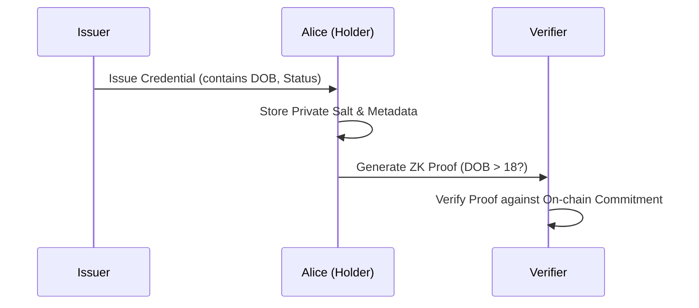
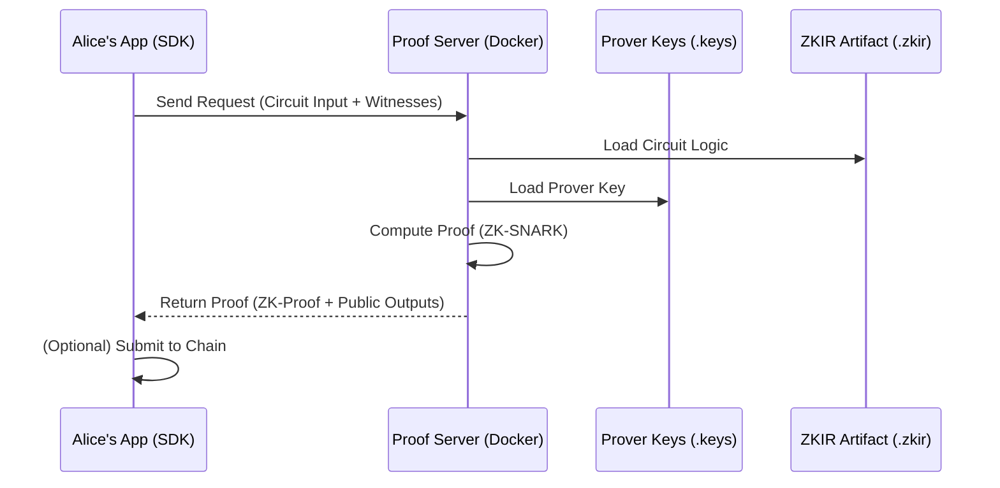

# Tutorial: Building a Decentralized Identity (DID) System on Midnight

Welcome to the Midnight DID tutorial. In this guide, you will learn how to build a privacy-preserving identity system using **Midnight**, a data-protection blockchain. 

By the end of this tutorial, you will have implemented an end-to-end flow where an **Issuer** grants a credential to a **Holder**, who then proves specific facts about that credential to a **Verifier** without revealing any sensitive data.

---

## Prerequisites

- **Midnight Compact Compiler**: v0.30.0+
- **Midnight SDK**: v4.0.2+
- **Docker**: For running the `midnight-proof-server`.
- **Node.js**: v22.0.0+

---

## 1. Project Initialization

Midnight applications are composed of **Compact** smart contracts (on-chain logic) and **TypeScript/JavaScript** (off-chain logic).

Start by scaffolding your project:
```bash
npx @midnight-ntwrk/create-mn-app ./my-did-tutorial
cd my-did-tutorial
```

Ensure your `package.json` includes the core Midnight dependencies:
```json
"dependencies": {
  "@midnight-ntwrk/compact-js": "2.5.0",
  "@midnight-ntwrk/compact-runtime": "0.15.0",
  "@midnight-ntwrk/midnight-js-http-client-proof-provider": "4.0.2",
  ...
}
```

---

## 2. Architecting the Identity Flow

In a DID ecosystem, we have three main actors:



---

## 3. Developing Smart Contracts

We will use **Compact**, Midnight's data-protection language.

### The DID Registry (`did-registry.compact`)
The registry stores DID documents and public keys. We use a `Map` to store state on the Midnight L1.

```compact
pragma language_version >= 0.22 && <= 0.23;

import CompactStandardLibrary;

export ledger did_registry: Map<Bytes<32>, DIDEntry>;

export { registerDID, updateDocument }

circuit registerDID(
    did_id: Bytes<32>,
    document_commitment: Bytes<32>,
    controller_pk: Bytes<32>
): [] {
    const d_id = disclose(did_id);
    const d_doc = disclose(document_commitment);
    const d_pk = disclose(controller_pk);

    assert(!did_registry.member(d_id), "DID already exists");
    did_registry.insert(d_id, DIDEntry { document_commitment: d_doc, controller_pk: d_pk });
}
```

> [!IMPORTANT]
> **ZKIR Identification**: In Compact 0.30.0, to ensure your circuits generate Zero-Knowledge IR (ZKIR) and prover keys, ensure they are **exported** and interact with a **Ledger structure** (Map, Cell, or Counter).

### How a DID Gets Registered On-Chain

To understand how this contract interacts with the frontend application, let's trace the journey of a DID from its creation to being committed to the ledger.

**1. Generating the Identity off-chain**
The journey begins in the TypeScript application where we generate a new DID keypair. We use a derivation function that exactly mirrors the Compact circuit's `derive_pk` logic. This ensures that the same private key controls both the off-chain identity and the on-chain entry.

**2. Encoding Data for the Ledger**
The `registerDID` circuit expects three fixed-size arguments (`Bytes<32>`). To preserve privacy, we do not send the full DID document to the blockchain. Instead, we hash the DID string and the JSON document using SHA-256:
- `did_id`: The SHA-256 hash of the DID string, which serves as the map key.
- `document_commitment`: The SHA-256 hash of the full DID Document JSON.
- `controller_pk`: The derived raw 32-byte public key.

**3. Submitting the Transaction**
When the application calls `callTx.registerDID(...)`, the Midnight SDK takes over. It builds an unbalanced transaction, adds DUST fees, signs it with the unshielded keystore, and requests a Zero-Knowledge proof from the local Proof Server (`127.0.0.1:6300`). Finally, the proven transaction is submitted to the Midnight network.

```typescript
// Example from src/cli.ts
const didId         = toBytes32Hash(keyPair.did);             // sha256(did string) -> Bytes<32>
const docCommitment = toBytes32Hash(JSON.stringify(didDoc));  // sha256(DID Document) -> Bytes<32>
const controllerPk  = hexToBytes32(keyPair.publicKey);        // raw 32-byte pubkey -> Bytes<32>

// Submit to the network!
const tx = await deployed.callTx.registerDID(didId, docCommitment, controllerPk);
console.log(`✅ DID registered! Transaction ID: ${tx.public.txId}`);
```

**4. The On-Chain Circuit Executes**
Once the network processes the transaction, the `registerDID` circuit executes. The `disclose()` function transitions the private proof inputs into public ledger state. If the DID doesn't already exist, the contract permanently records the commitment and public key in the `did_registry` map.

**The Privacy Result:** The zero-knowledge proof verifies that the controller *knows* the correct inputs without actually revealing the private key. No personal data or full document structure ever touches the public ledger.

---

## 4. Zero-Knowledge proofs: The Verifier

The Verifier contract allows Alice to prove she is over 18 without disclosing her actual birth date.

### The ZK Proof Pipeline

Understanding how proofs are generated is critical:



### `verifier.compact`
We use `persistentHash` (a ZK-friendly Poseidon hash) to verify a commitment Alice holds.

```compact
circuit verifyAge(
    expected_dob: Field,
    expected_commitment: Bytes<32>
): [] {
    const d_exp_dob = disclose(expected_dob);
    const dob = dateOfBirth(); // Alice's secret witness
    const s = salt();          // Alice's secret witness

    // Verify Alice isn't lying about her commitment
    const computed = persistentHash<Vector<2, Bytes<32>>>([
        dob as Bytes<32>,
        s
    ]);
    assert(computed == disclose(expected_commitment), "Invalid commitment");
    
    // Prove the age logic without revealing 'dob'
    assert(dob == d_exp_dob, "Claimed DOB does not match");
}
```

---

## 5. Compiling and generating artifacts

Midnight requires **Prover Keys** to be generated before an application can create private proofs.

```bash
npm run compile
```

This generates the `managed/` directory containing:
- `index.js`: The contract boilerplate for the SDK.
- `zkir/`: The Zero-Knowledge Intermediate Representation.
- `keys/`: Prover and Verifier keys used by the proof server.

---

## 6. Integrating the SDK

Using the Midnight SDK, Alice can generate a proof by connecting to a local **Proof Server**.

### Alice's Proof Generation (`prove-age.ts`)
```typescript
import { NodeZkConfigProvider } from '@midnight-ntwrk/midnight-js-node-zk-config-provider';
import { httpClientProofProvider } from '@midnight-ntwrk/midnight-js-http-client-proof-provider';

// 1. Setup providers
const zkConfigProvider = new NodeZkConfigProvider(path.resolve('managed/verifier/compiler'));
const proofProvider = httpClientProofProvider('http://localhost:6300', zkConfigProvider);

// 2. Generate Proof
const result = await verifierInstance.circuits.verifyAge(
    contextWithProviders,
    ClaimedDOB,
    PublicCommitment
);
```

### Use Case 2: Accredited Investor Verification (Prove Accreditation Without Revealing Net Worth)

Regulated DeFi pools often require accredited investor status. Disclosing net worth publicly would be a serious privacy violation — and a regulatory risk.

**Credential schema for accreditation (`schemas/investor-credential.json`):**
```json
{
  "$schema": "https://json-schema.org/draft/2020-12/schema",
  "title": "Accredited Investor Schema",
  "description": "Schema for verifying accredited investor status.",
  "type": "object",
  "properties": {
    "status": {
      "type": "string",
      "enum": ["accredited", "non-accredited"]
    },
    "accreditationDate": {
      "type": "string",
      "format": "date"
    }
  },
  "required": ["status", "accreditationDate"]
}
```

**Proof Generation (`prove-investor.ts`):**
```typescript
// 1. Setup providers
const zkConfigProvider = new NodeZkConfigProvider(path.resolve('managed/verifier/compiler'));
const proofProvider = httpClientProofProvider('http://localhost:6300', zkConfigProvider);

// 2. Generate Proof
const result = await verifierInstance.circuits.verifyAccredited(
    contextWithProviders,
    IsAccreditedStatus,
    PublicCommitment
);
```

### Use Case 3: Privacy-Preserving KYC/AML

Regulated financial services can't simply ignore KYC — but they also don't need to store every user's passport scan in a centralized database. Here's how Midnight enables compliant KYC without a data honeypot.

---

## Conclusion

You've built a full Decentralized Identity system on Midnight! This tutorial demonstrated:
1.  **Selective Disclosure**: Alice proved her age without revealing it.
2.  **On-Chain Registry**: The Issuer's signature links Alice to her credential.
3.  **Local Privacy**: Alice generated her own proof locally, keeping her secrets private.

**Next Steps**: 
- Integrate a real user wallet like **Lace** or **Midnight Dust Wallet**.
- Deploy your contracts to the **Midnight Preprod** network.
- Add complex schema validation for different credential types.

Happy coding on Midnight!
